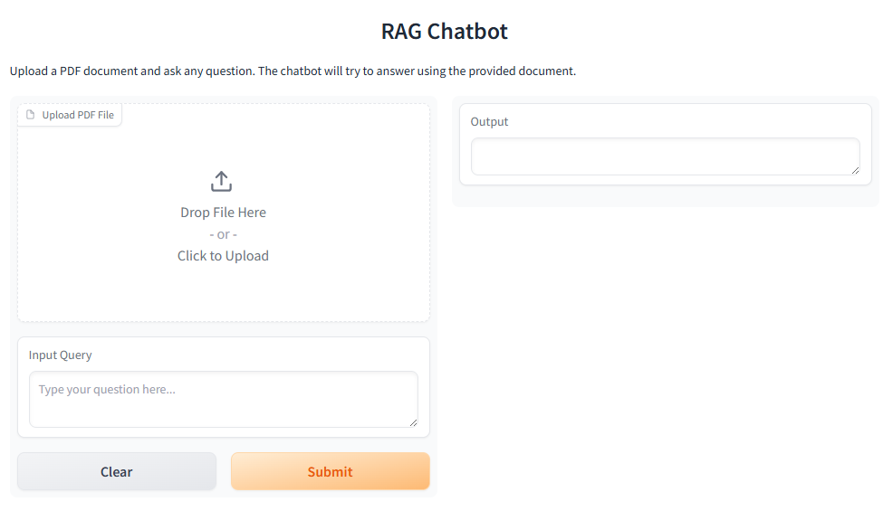
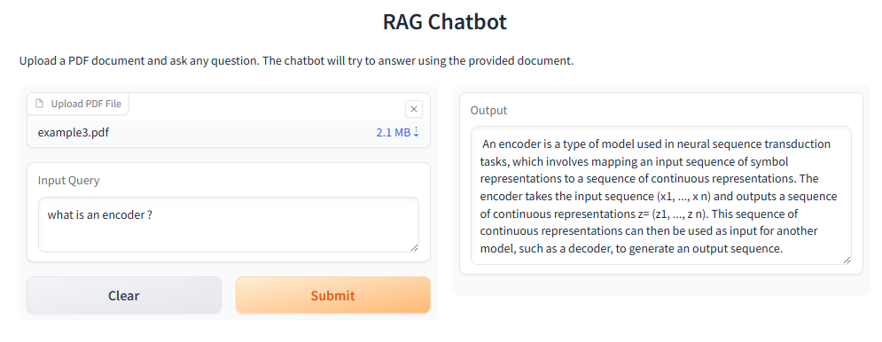

# Watsonx-powered-PDF-Question-Answering-RAG-Chatbot


_Created by **Réka Gábosi**_

## Table of Contents

- [Description](#description)
- [What I built](#what-i-built)
- [How to run](#how-to-run)
- [Example](#example)
- [Future ideas](#future-ideas)
- [License](#license)
- [Acknowledgements](#acknowledgements)

## Description

This project was created as the final project for **IBM’s _Generative AI Applications with RAG and LangChain_** course.

It is a Retrieval-Augmented Generation (RAG) chatbot that allows you to:

- Upload any PDF file
- Ask questions about its contents
- Receive natural language answers generated by **Watsonx's Mixtral-8x7B** LLM, grounded in retrieved document chunks

## What I built

- ✅ Implemented end-to-end RAG pipeline with `WatsonxLLM`, `WatsonxEmbeddings`, and `Chroma`
- ✅ Used `LangChain` components: PyPDFLoader, RecursiveCharacterTextSplitter, and RetrievalQA
- ✅ Built an intuitive frontend with `Gradio` for interactive Q&A
- ✅ Integrated IBM Watsonx's proprietary embedding and foundation models

## How to run

Install the required packages and run the app using Python 3.11:
```bash
pip install -r requirements.txt
python3.11 app.py
```

Then open your browser to:
```bash
http://localhost:7860
```

## Example

Below are two screenshots demonstrating how the application works:

### 🖥️ Launch Screen

When you open the application in your browser, you'll see a simple Gradio interface allowing you to upload a PDF and input a query:



### 💬 Question & Answer

Here’s an example of asking a question about the uploaded PDF. The answer is generated using the Mixtral-8x7B LLM and grounded in the document content:



## Future ideas

- 📚 Add support for uploading multiple PDFs at once  
- 🔍 Implement semantic search preview before answering  
- 💾 Add history logging for previous Q&A sessions  
- 🧠 Swap in IBM Granite models when available for comparison  
- 🐳 Include a Docker container and Hugging Face Space deployment option  

## License

This project includes original work by the author and code based on IBM’s *Generative AI Applications with RAG and LangChain* course.

All code authored for this repo is released under the [Apache License 2.0](https://www.apache.org/licenses/LICENSE-2.0).

## Acknowledgements

- 🏢 **IBM** – for offering the hands-on course that inspired and enabled this project  
- 🧩 **LangChain** – for the powerful RAG architecture and document tools  
- ⚙️ **Watsonx.ai** – for robust embedding and LLM support  
- 💻 **Gradio** – for making interactive AI apps quick to prototype